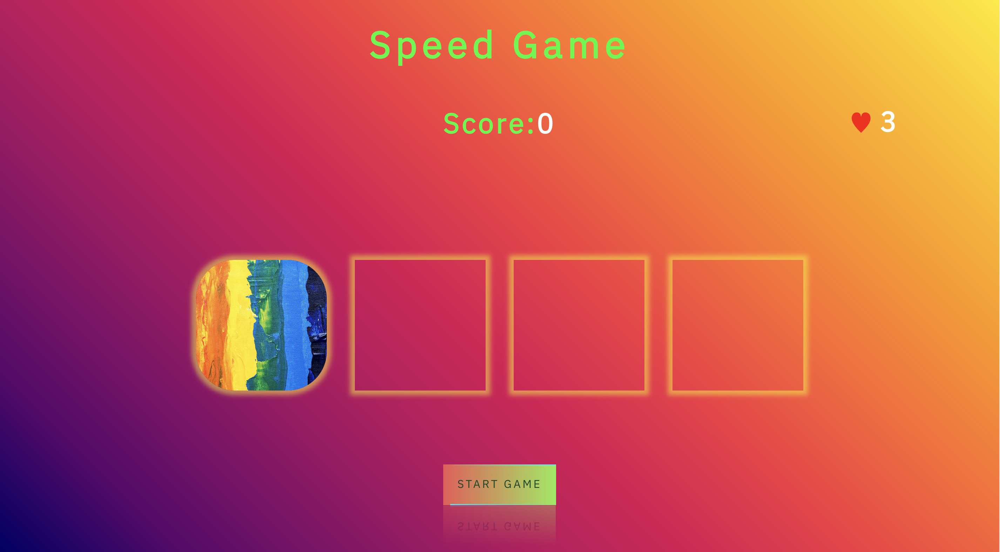
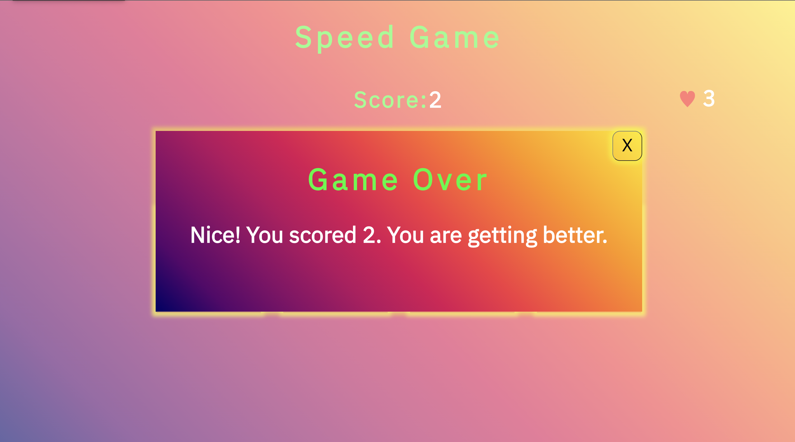

# Rainbow Click- A Speed Game on React

### A project done in react for Fullstack Web Development Program, BCH,Helsinki

## Developed using

* React JS
* HTML
* CSS

## Game Screen/Start Screen

## Overlay Screen

## Game rules

#### Start game button starts the game.
#### Player have to click correct active circle to get score(one correct click is equal to one point).
#### The speed of active circle randomness increases relatively, 3 wrong clicks is game over.
#### Overlay Modal shows your score. Restart the game to play again.

